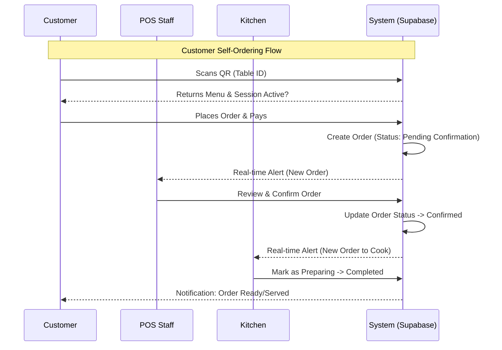

# 🏗️ High Level Design (HLD) — Odoo Cafe POS

## 1. System Architecture Overview

The Odoo Cafe POS system is designed as a modern, web-based application utilizing a decoupled client-server architecture. It leverages **React** for the frontend interfaces and **Supabase** for the backend infrastructure, providing real-time capabilities essential for a restaurant environment.

### 1.1 High-Level Diagram

```mermaid
graph TD
    User[Users & Customers]
    
    subgraph "Frontend Clients (React + Vite)"
        POS[POS Terminal (Staff)]
        KDS[Kitchen Display System]
        CustomerApp[Customer QR Order App]
    end
    
    subgraph "Backend Services (Supabase)"
        Auth[Authentication Service]
        DB[(PostgreSQL Database)]
        Realtime[Realtime Subscriptions]
        Storage[File Storage]
    end
    
    User -->|Interacts| POS
    User -->|Interacts| KDS
    User -->|Scans QR| CustomerApp
    
    POS <-->|API / WebSocket| Supabase
    KDS <-->|API / WebSocket| Supabase
    CustomerApp <-->|API / WebSocket| Supabase
    
    Supabase --> Auth
    Supabase --> DB
    Supabase --> Realtime
    Supabase --> Storage
```

---

## 2. Core Components

### 2.1 POS Terminal (Staff Interface)
- **Role:** Central control unit for restaurant operations.
- **Key Features:**
  - Table management (interactive floor plan).
  - Menu browsing and manual order creation.
  - Order confirmation queue for customer-initiated orders.
  - Payment processing (Cash, Card, UPI).
  - Session management (Open/Close shift).

### 2.2 Kitchen Display System (KDS)
- **Role:** Real-time order management for kitchen staff.
- **Key Features:**
  - Displays incoming confirmed orders instantly.
  - Order status updates (To Cook -> Preparing -> Completed).
  - Filtering by course or category (Post-MVP).

### 2.3 Customer QR Ordering App
- **Role:** Self-service interface for customers.
- **Key Features:**
  - Accessible via QR code scan (no app download required).
  - Digital menu browsing.
  - Cart management and self-checkout.
  - Integration with digital payment gateways (UPI/Card).
  - Real-time order status tracking.

---

## 3. Data Flow & Processes

### 3.1 Order Lifecycle Flow



### 3.2 Payment Flow
- **Customer:** Pre-payment required via UPI/Digital methods to place an order.
- **POS Manual:** Staff collects payment (Cash/Card) and marks the order as paid.

---

## 4. Database Schema Design (PostgreSQL)

### 4.1 Tables

#### `tables`
| Column | Type | Description |
|---|---|---|
| `id` | UUID | Primary Key |
| `table_number` | String | Display labels (e.g., T1, T2) |
| `qr_code_url` | String | Link to the generated QR code |
| `scanned_count` | Integer | Analytics (Optional) |

#### `products`
| Column | Type | Description |
|---|---|---|
| `id` | UUID | Primary Key |
| `name` | String | Product Name |
| `price` | Decimal | Unit Price |
| `category` | String | Grouping (e.g., Starters, Mains) |
| `is_available` | Boolean | Stock status |

#### `orders`
| Column | Type | Description |
|---|---|---|
| `id` | UUID | Primary Key |
| `session_id` | UUID | Link to active POS session |
| `table_id` | UUID | Link to Table |
| `status` | Enum | `pending_confirmation`, `confirmed`, `preparing`, `completed`, `cancelled` |
| `payment_status` | Enum | `paid`, `unpaid` |
| `total_amount` | Decimal | Final bill amount |
| `created_at` | Timestamp | Order creation time |

#### `order_items`
| Column | Type | Description |
|---|---|---|
| `id` | UUID | Primary Key |
| `order_id` | UUID | Header Link |
| `product_id` | UUID | Product Link |
| `quantity` | Integer | Count |
| `price` | Decimal | Snapshot price at time of order |

#### `sessions`
| Column | Type | Description |
|---|---|---|
| `id` | UUID | Primary Key |
| `opened_at` | Timestamp | Start of shift |
| `closed_at` | Timestamp | End of shift (Null if active) |
| `total_sales` | Decimal | Aggregated revenue |

---

## 5. Technology Stack & Choices

| Component | Technology | Reasoning |
|---|---|---|
| **Frontend** | React.js + Vite | Fast development, component reusability, optimal performance. |
| **Styling** | Tailwind CSS | Rapid UI development, consistency, mobile-first design. |
| **Backend** | Supabase | Instant APIs, built-in Auth, PostgreSQL, and critically **Realtime** capabilities for POS/Kitchen sync. |
| **Database** | PostgreSQL | Robust relational data handling. |
| **Routing** | React Router | Client-side navigation management. |
| **Icons** | Lucide React | Clean, modern visual assets. |

## 6. Security & Scalability

### 6.1 Security
- **Authentication:** Supabase Auth for staff access. Customers access via public session tokens linked to QR codes.
- **Row Level Security (RLS):** Policies to ensure:
  - Customers can only see/create orders for their active table session.
  - Staff can access all data.
- **Input Validation:** Strict type checking on both frontend and database constraints.

### 6.2 Scalability
- **Supabase Edge Functions:** For complex logic (e.g., nightly reports) offloading from the client.
- **CDN:** Assets served via global CDN for fast loading.
- **Horizontal Scaling:** Supabase allows scaling the database tier as transaction volume grows.

---

## 7. Future Considerations (Post-MVP)
- **Inventory Management:** Deduct stock automatically upon order.
- **CRM:** Customer loyalty points derived from payment data.
- **AI Analytics:** Predictive ordering suggestions for kitchen prep.
