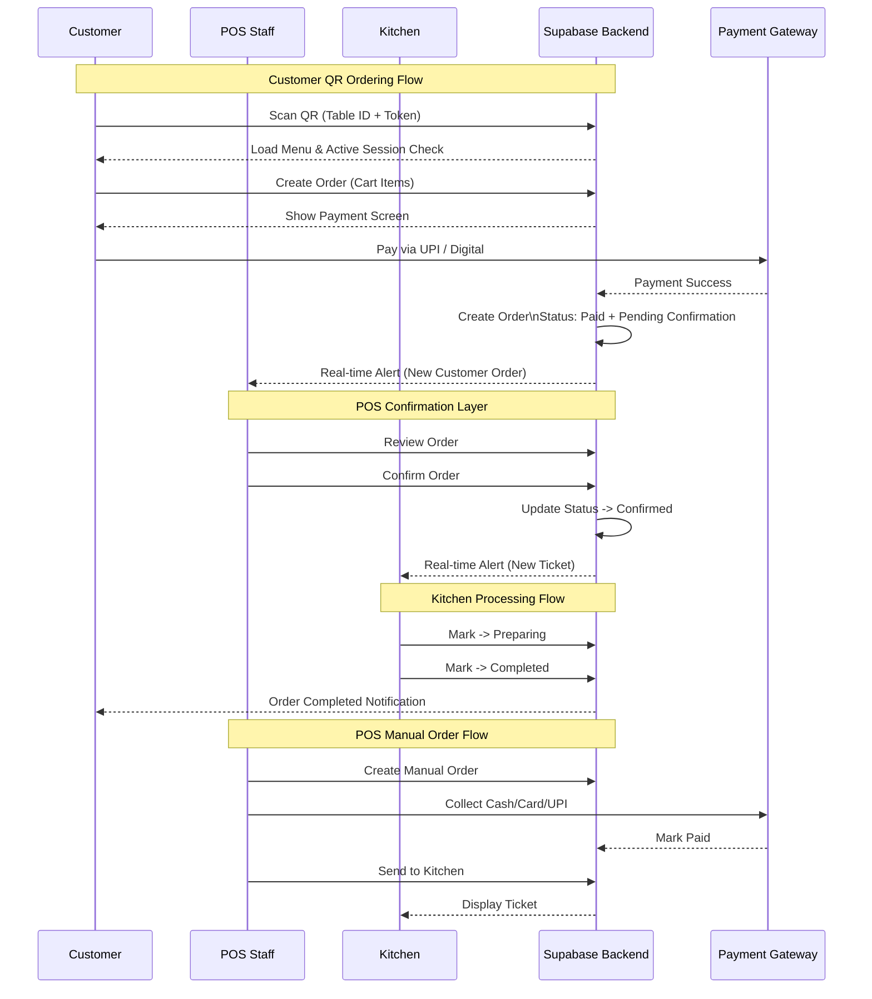

```mermaid block
sequenceDiagram
    participant Customer
    participant POS as POS Staff
    participant Kitchen
    participant System as Supabase Backend
    participant Payment as Payment Gateway

    Note over Customer,System: Customer QR Ordering Flow

    Customer->>System: Scan QR (Table ID + Token)
    System-->>Customer: Load Menu & Active Session Check

    Customer->>System: Create Order (Cart Items)
    System-->>Customer: Show Payment Screen

    Customer->>Payment: Pay via UPI / Digital
    Payment-->>System: Payment Success

    System->>System: Create Order\nStatus: Paid + Pending Confirmation
    System-->>POS: Real-time Alert (New Customer Order)

    Note over POS,System: POS Confirmation Layer

    POS->>System: Review Order
    POS->>System: Confirm Order
    System->>System: Update Status -> Confirmed
    System-->>Kitchen: Real-time Alert (New Ticket)

    Note over Kitchen,System: Kitchen Processing Flow

    Kitchen->>System: Mark -> Preparing
    Kitchen->>System: Mark -> Completed

    System-->>Customer: Order Completed Notification

    Note over POS,System: POS Manual Order Flow

    POS->>System: Create Manual Order
    POS->>Payment: Collect Cash/Card/UPI
    Payment-->>System: Mark Paid
    POS->>System: Send to Kitchen
    System-->>Kitchen: Display Ticket
```